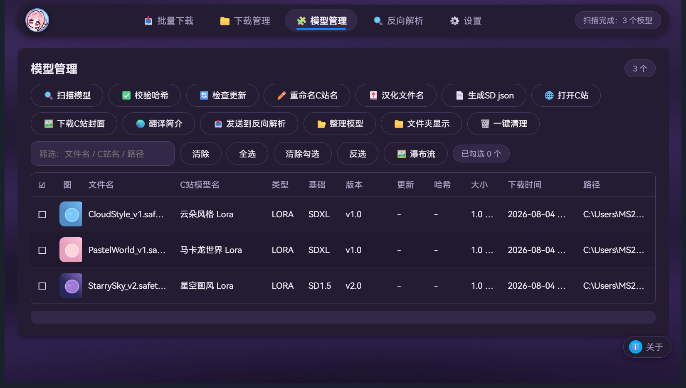
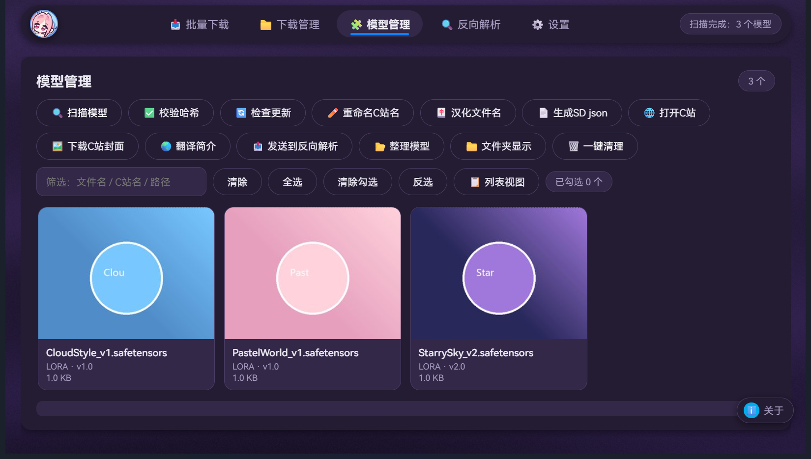
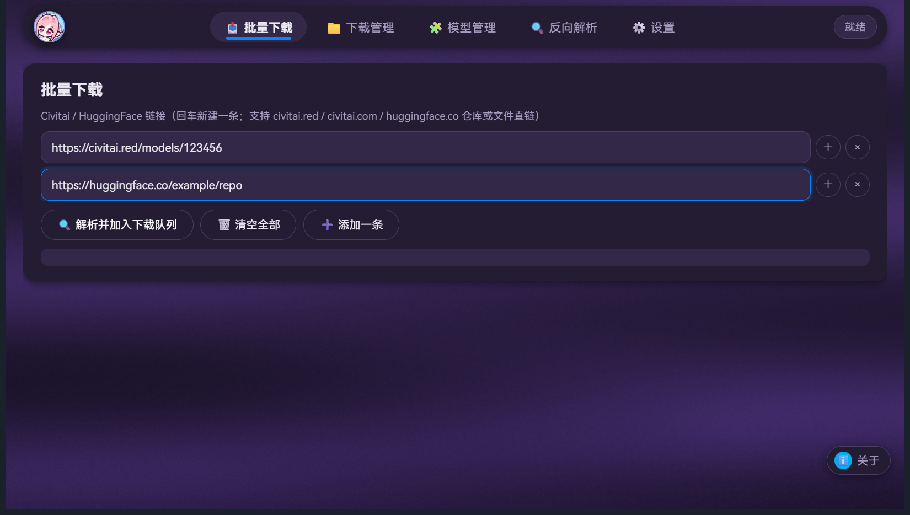

<div align="center">

# CivitaiFreeTool

**Civitai / HuggingFace 模型下载、管理、反向解析工具（免费 · 全功能 · 无付费墙）**

[](LICENSE)
[](https://github.com/ADVICEsama/CivitaiFreeTool)
[](https://github.com/ADVICEsama/CivitaiFreeTool/releases)

因为受够了"又丑又收费"的模型下载器，所以自己写了一个：**免费、好看、全功能**。

</div>

---

## ✨ 功能一览

### 📥 批量下载
- 支持 **Civitai**（civitai.red / civitai.com）与 **HuggingFace**（仓库或文件直链）
- 剪贴板多行链接**自动拆行批量入队**，回车新建一条
- HF 仓库自动列出全部文件，勾选下载、**保留原始目录结构**

### ⬇️ 下载管理
- 断点续传 · 并发下载 · 速度实时显示 · 失败自动重试
- 任务进度持久保存，**关掉软件再开不丢**
- 下载完成自动 **SHA256 校验**

### 🧩 模型管理
- 扫描模型目录，按子文件夹设置显示/隐藏
- 封面缩略图 + 文件名 / C 站名双列对照
- 一键**重命名为 C 站名称**（预览图/json/info 同步改名）
- SHA256 校验 · 检查更新 · 分类整理规则 · 一键清理 · HTML 图例

### 🖼️ 瀑布流视图
- 封面大图卡片式浏览，点击勾选、右键直达操作
- 全局 **Ctrl+滚轮缩放**，大屏小屏都舒服

### 🔍 反向解析
- 本地模型 SHA256 → C 站反查，**模型名 / 触发词 / 封面 / 简介全部补回**
- 生成 civitai.info / SD 兼容 json（可在设置页选格式）
- 内置**百度翻译**，简介一键汉化

### 🎨 界面
- 深色 / 浅色 / 现代浅色**三套主题**
- HarmonyOS Sans 字体 · 自定义滚动条 · Mica 窗口效果（Win11）
- 首次使用**三步引导**：选主题 → 设目录 → 填 API Key（含注册教程）

---

## 🚀 运行方式

**免安装版（推荐）**：下载 `CivitaiFreeToolWeb.exe`（单文件，无需安装 Python）→ 双击运行

**源码版**：
```bash
# 需要 Python 3.10+
pip install pywebview pillow requests
python main_web.py      # Web 界面版
python main.py          # Tk 界面版（备选）
```

> ⚠️ **首次运行会自动弹出三步引导**：选择主题 → 设置下载目录（默认软件根目录 `downloads/models`）→ 填写 Civitai API Key（不填也能用，部分功能受限；获取方式见设置页"百度翻译申请指南"旁的内置引导）。

---

## 📸 截图

| 模型管理（列表） | 瀑布流视图 | 批量下载 |
|:---:|:---:|:---:|
|  |  |  |

---

## ⚙️ 配置

- 配置保存在程序同目录的 `user_config.json`（**请勿分享该文件，内含你的 API Key**）
- API Key 获取：登录 [civitai.com](https://civitai.com) → 账号设置 → API Keys
- 百度翻译（可选，用于简介汉化）：[百度翻译开放平台](https://fanyi-api.baidu.com/product/11) 免费申请

---

## 📦 Release 下载

前往 **[Releases](https://github.com/ADVICEsama/CivitaiFreeTool/releases)** 下载最新的免安装 exe。

---

## 📄 License

本项目采用 **MIT License**。字体资源 HarmonyOS Sans SC 版权归华为所有，仅供免费使用。

---

## ⚠️ 免责声明

- 数据来自 Civitai / HuggingFace 官方公开 API，请遵守其服务条款
- 模型版权归原作者所有，请遵守各模型页面的许可协议
- 本工具为独立编写的免费软件，与任何商业软件无关
