# CivitaiFreeTool

> 免费的 Civitai / HuggingFace 模型下载与本地模型管理工作台。

  

[下载最新版](https://github.com/ADVICEsama/CivitaiFreeTool/releases/latest) · [更新日志](CHANGELOG.md) · [问题反馈](https://github.com/ADVICEsama/CivitaiFreeTool/issues) · [Linux / macOS](LINUX.md)

## 当前工作台

- **左侧导航 + 常驻模型详情**：列表/瀑布流共用管理能力；单击仍选中模型，同时更新右侧详情；勾选格独立用于批量选择。打开详情不挤走模型卡片。无可见顶栏，右上角保留窗口按钮，顶部空白和页面标题可拖动。
- **目录记录管理**：收藏胶囊中键取消收藏；右键打开所在位置或清理收藏/失效记录，绝不删除磁盘目录与模型。失效目录仍能清理，确认选择前重新检查。
- **批量移动**：模型管理勾选多个模型 → 整理 → 批量移动到…文件夹，一次选择并确认。模型、JSON、封面和示例图一同移动，冲突跳过不覆盖，进度及失败单独报告。
- **紧凑信息列**：勾选固定小列、名称按档位定宽，路径承担剩余空间；保留其余列手动宽度，避免勾选格占半行。
- **三档模型列表**：完整为当前最大样式；紧凑同时收起封面和作者，保留本地文件名；极简精简为 C站名称与勾选格，但类型、基础模型、版本、更新、大小、下载时间与路径等信息列在三档中都保留。悬停“列表”按钮调节，设置自动保存，不改变全局缩放或瀑布流。
- **当前模型立即识别**：详情按钮一次点击直接开始，不跳页、不启动其它排队模型；左下角显示进度，成功更新当前详情。
- **全功能快捷键入口**：设置中搜索功能，点击绑定按钮录入一次组合键；修改后左侧出现单项重置。无多预设选择，只有一套常规初始值；Esc / 退格清除，Tab / 失焦取消。默认关闭；大图左右键也受总开关约束，输入/确认弹窗中不触发，Delete 仍需回收站确认。
- **双位置状态反馈**：保留左下角，同时在底部中央弹出自动消失圆胶囊；不会拦截鼠标，不盖住设置页底部操作。
- **设置防呆**：未保存时离页或关窗，选择保存并离开、放弃修改或继续编辑；保存失败仍留在原页。已即时保存的选项不重复提醒。
- **持久下载任务与历史**：任务前勾选框与表头全选，单击选中；支持全部暂停、全部移除确认、全部结束任务移入历史。自动保存任务；已结束任务可收进独立历史。历史提供缩略图/信息缓存、保存到文件夹、打开实际文件位置、C站入口，以及模型卡片定位。
- **文件夹显隐**：可选择哪些文件夹的模型显示，隐藏父目录也隐藏子目录；锁定顶部工具栏时菜单仍正常展开，选择自动保存，不移动或删除文件。
- **更清楚的右键菜单**：常用动作直接展示；复制、改名与整理、元数据与更新按用途折叠。删除进入回收站并确认。
- **图片与生成数据**：大图可拖动、连续跟手缩放（相对适合窗口 5%–3200%），滚轮立即响应、按钮短促快到慢过渡、翻页、右键复制/保存；半透明背景保留后面的模型页。读取原图 PNG/ComfyUI/EXIF 元数据，并按图片 ID 查询 C站 `withMeta=true` 数据。资源按明确 ID / URL / AIR 直达当前站点，版本 ID 使用站点原生重定向，不依赖额外 API 查询、不自动搜索 ID；默认 civitai.red。提示词、资源和采样参数只显示来源实际提供的内容。
- **收藏与固定工具栏**：模型右键或详情星标收藏置顶，改名/移动跟随；标题右侧固定菜单，让滚轮只滚动模型列表。
- **本地原图缓存**：只保存打开过的原图和来源生成数据，已缓存的在线示例图可在详情中提前恢复高清与信息，不预下载未查看的在线图；同一会话重开直接复用已解码图片，重启后首次查看仍需读磁盘与解码；默认 1 GB，可关闭、调容量或清理，随软件数据迁移。不含任何运行缓存的源码/便携包。
- **滚轮导航**：鼠标停在左侧菜单，滚轮上下切换页面；Ctrl + 滚轮仍用于全局缩放，首尾不循环。
- **分组设置**：常用、外观、下载、目录、分类整理、网络、翻译、维护；跨分类搜索，分类规则旁直接提供步骤与示例。
- **自由外观**：14 套配色、本地字体名称即预览、五档独立字号与图标尺寸、强调色、密度、圆角和局部画布交互特效；动画上限可输入 15–360，0 跟随屏幕（不保证达到指定帧率）。瀑布流按钮悬停展开竖向图片大小滑条。

## 界面示例

下面是 **当前前端的演示截图**：使用虚构模型、文件路径及程序绘制的风景；不包含用户 API Key、私有模型或真实下载任务。它们用于展示界面，不代表下载或生成结果。

### 模型管理与常驻详情

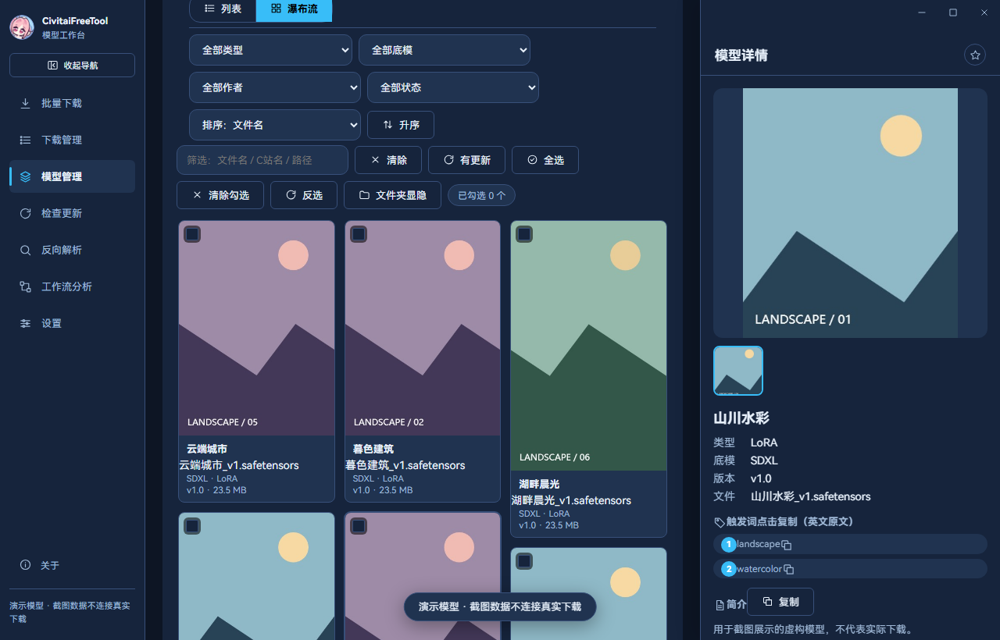

### 模型列表三档大小

完整（最大）：

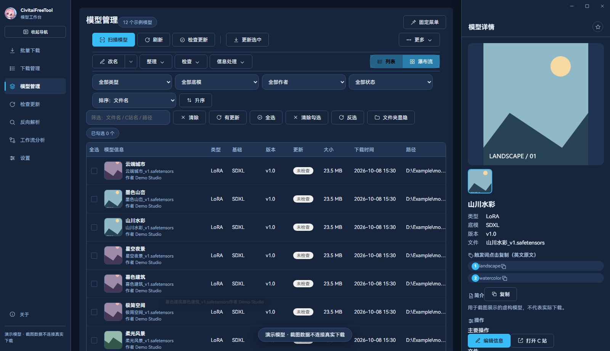

紧凑（无封面与作者）：

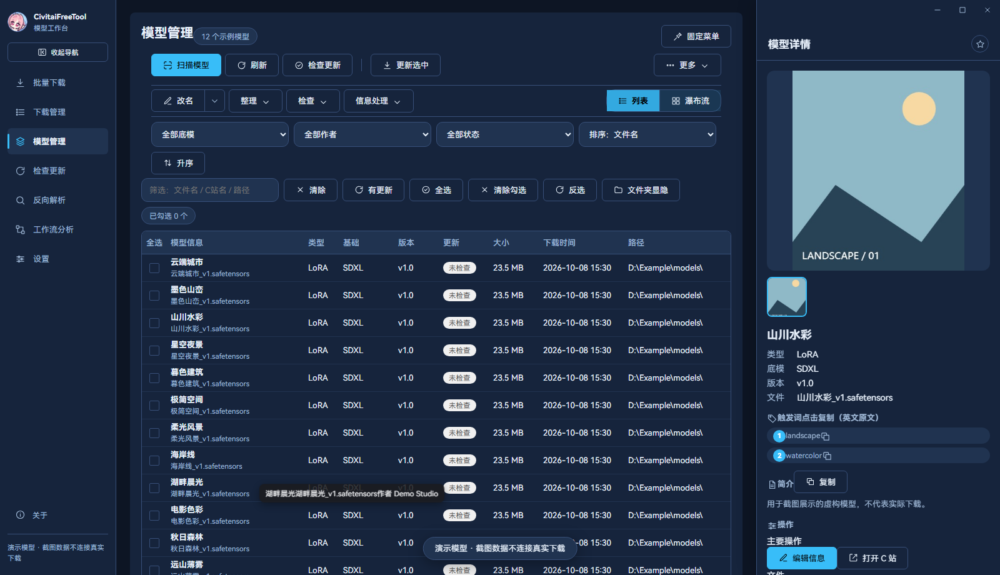

极简（精简名称，保留基础、版本等信息列；窄窗可横向滚动）：

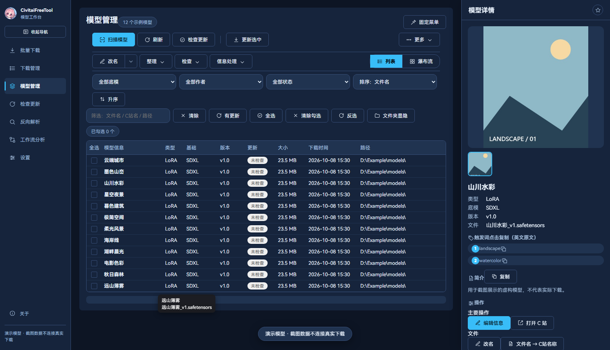

### 下载目录收藏与失效记录管理

右键只清理记录，不删除磁盘文件；胶囊中键取消收藏。

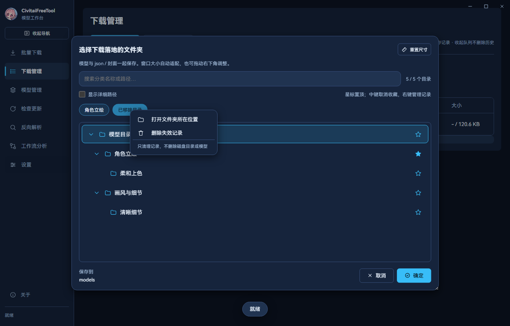

### 快捷键设置与底部状态胶囊

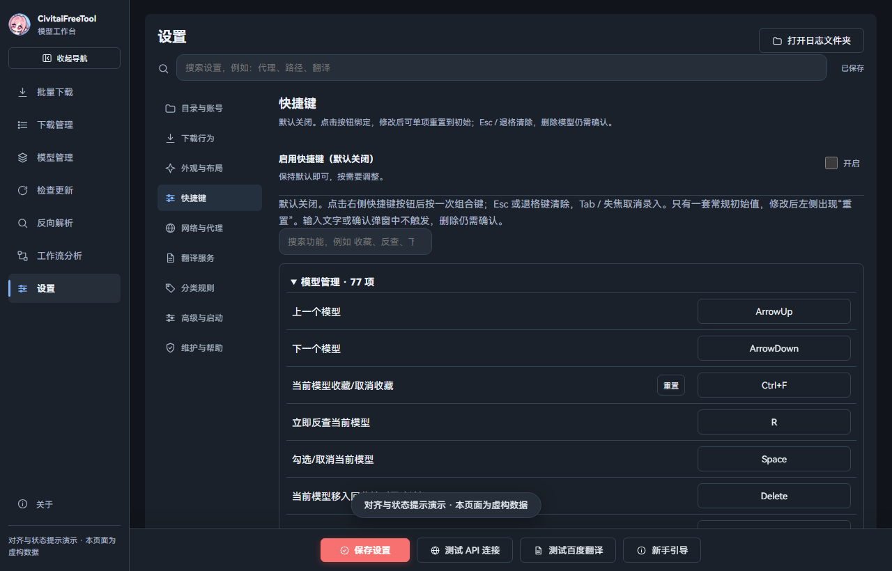

### 大图、半透明背景与生成数据

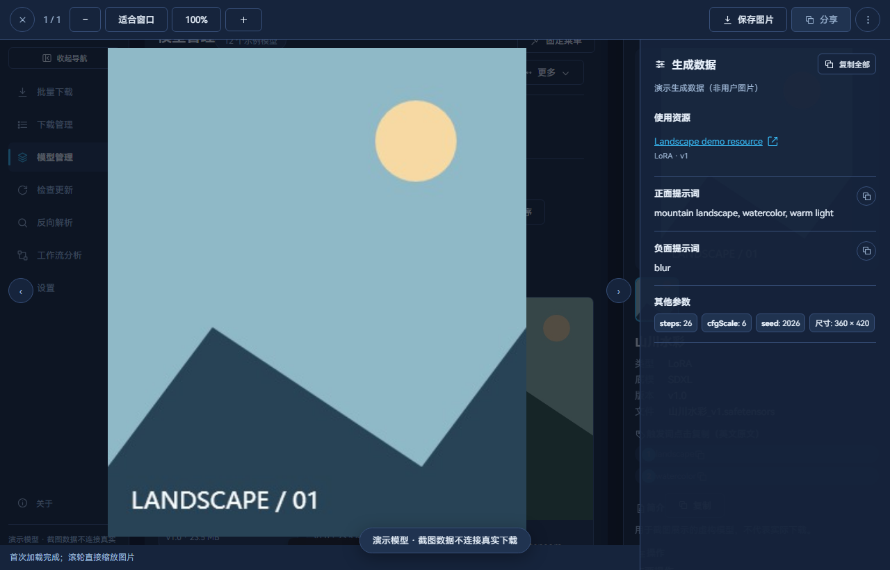

### 下载历史

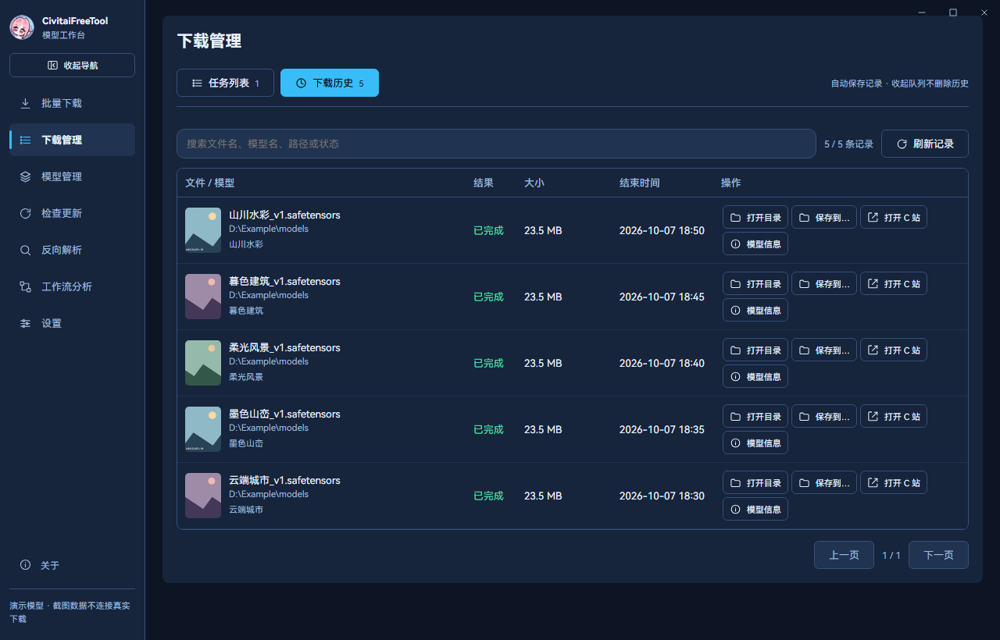

### 外观设置

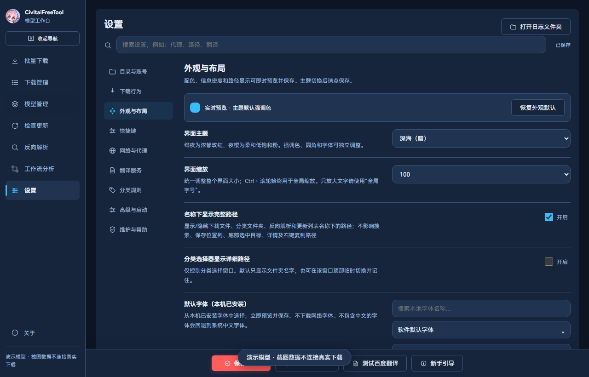

### 分类规则与使用介绍

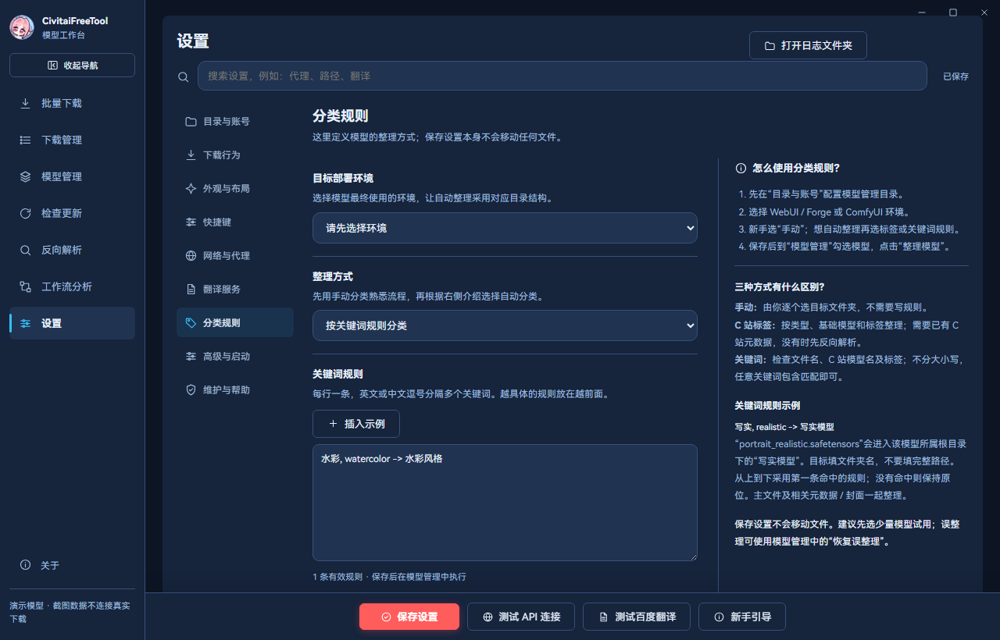

### 页面式引导

先在 civitai.red 申请并填写 API Key；空值不能继续或跳过，Key 先保存。之后保留六步结构中的页面介绍，七个页面都给出说明。点击页面卡片直接体验，引导缩到右下角，可随时继续。不会自动下载。

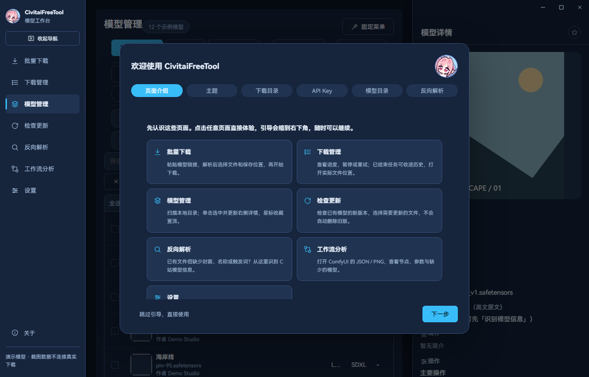

## 快速开始（Windows）

1. 在 [Releases](https://github.com/ADVICEsama/CivitaiFreeTool/releases/latest) 下载 Windows 便携 ZIP 或版本号 EXE。
2. 解压到个人可写目录，运行 `CivitaiFreeToolWeb.exe`。默认启动软件窗口，失败才按兜底开关打开浏览器。设置“启动界面”为浏览器后，以后直接启动浏览器，不创建软件窗口；选择即保存、重启生效。临时打开浏览器不会改长期模式。
3. 设置下载目录、模型管理目录；如需要，在 C站账户中申请 API Key 后填写。它不是使用本地模型管理的前提。
4. 粘贴 Civitai / HuggingFace 链接进行下载，或扫描已有模型。

**更新已有安装只替换 EXE，保留配置、任务、历史和缓存。** 新版默认把软件信息存放在 EXE 旁，可在「设置 → 目录」迁移到个人目录；不要把配置目录当作临时文件删除。

### 隐私与 Key

- `user_config.json` 可能包含 API Key、翻译密钥或代理信息，**不要上传或分享**。
- 配置、任务/历史 JSON、模型文件和运行缓存不属于发布源码/便携包。
- 示例截图与测试使用虚构数据。遇到问题提供日志时仍需先脱敏。
- 客户端访问 C站使用账户权限；不绕过付费、Early Access、浏览等级或访问限制。

## 下载与模型管理

- 多链接批量解析、断点续传、并发下载、暂停/重试；SHA256 校验，拒绝把 HTML 错误页面当成模型。
- 多目录扫描、关键词/底模/作者/状态/文件夹筛选、列宽调整及多种排序。
- 自定义改名、文件名 → C站名称、文件名翻译；按手动分类、tags 或自定义规则整理。
- 移动模型连同 sidecar/预览图/images 目录；冲突拒绝覆盖。历史路径同步更新，误整理可按日志恢复。
- 更新检测、版本选择、更新白名单；更新下载由用户触发，默认保留旧版。
- SHA256 反向识别模型、简介翻译、触发词复制、封面选择；解析 ComfyUI 工作流中的模型引用和提示词。

## 外观与快捷键

| 操作 | 行为 |
| --- | --- |
| Ctrl + 滚轮 | 全局界面缩放 |
| Alt + 滚轮（瀑布流） | 调整模型图片大小 |
| 图片查看器普通滚轮 | 缩放当前图片 |
| 按住放大后的图片拖动 | 移动查看位置 |
| 图片查看器空白处 / Escape | 关闭大图；有右键菜单时 Escape 先关闭菜单 |
| 双击窗口拖动区 | 最大化 / 还原 |

Mica / Mica Alt 是 Windows 原生**壁纸色调材质**，并不透视其他窗口；失焦、系统关闭透明、高对比度等条件下会回退纯色。内置效果需要支持的 Windows 11；外部模式配合 Mica For Everyone 需要另行安装/配置，框架切换需重启。参见 [微软 Mica 说明](https://learn.microsoft.com/en-us/windows/apps/design/style/mica)。

## Chrome / Firefox 扩展

Release 同时附带两款扩展 ZIP，`manifest.json` 在压缩包根目录。

- **Chrome / Edge**：解压 Chrome 包，在扩展管理页启用开发者模式，加载已解压目录。
- **Firefox**：当前包未签名，通过 `about:debugging` 临时加载；长期安装需要 Mozilla 签名。不能把它当作已签名永久扩展。
- 软件运行后，在 C站模型页点击扩展图标，确认模型与链接后添加下载。

详细说明：[Chrome](chrome-extension/README.md) · [Firefox](firefox-extension/README.md)。

## 源码运行与构建

Windows 使用 Python 3.12 与现有 `requirements.txt`：

```powershell
python -m venv .venv
.\.venv\Scripts\python -m pip install -r requirements.txt
.\.venv\Scripts\python main_web.py --window
# 构建：Spec 包含网页、原生辅助 DLL、托盘及 Tcl/Tk
.\.venv\Scripts\python -m pip install pyinstaller
.\.venv\Scripts\python -m PyInstaller -y CivitaiFreeToolWeb.spec
```

原生辅助代码由 Windows 自带 .NET Framework C# 编译器构建，不需要额外安装完整 Visual Studio。Linux/macOS 使用社区提供的适配，安装依赖与限制见 [LINUX.md](LINUX.md)；本轮原生窗口验证在 Windows 完成，不声称其他平台已复测。

## 测试、贡献与维护

- 后端/桥服务回归与隔离前端测试位于 `tests/`；需要真实窗口的改动另做原生检查。
- GitHub Actions 的状态以实际运行结果为准，版本号/本地测试通过不等于远端 CI 已通过。
- 修复后发布包含 EXE、Windows ZIP、源码 ZIP、两款扩展和 SHA256 的完整附件，见 [发布流程](docs/RELEASING.md)。
- 感谢 [guanhaisen](https://github.com/guanhaisen)、[LckHot](https://github.com/LckHot) 等社区贡献；本次 [Fork 检查](docs/FORKS.md) 说明哪些分支存在独立变更及检查范围。

详细历史请看 [CHANGELOG.md](CHANGELOG.md)，不再用旧版 Emoji/双主题截图代表当前工作台。

## 反馈

[GitHub Issues](https://github.com/ADVICEsama/CivitaiFreeTool/issues) · [作者 B 站](https://space.bilibili.com/273101122) · 粉丝群：909810278
